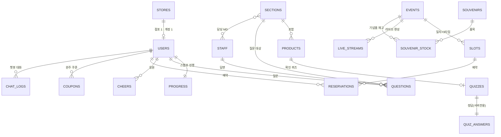

# ERD — 2027 GS25 상품전략공유회 온라인 전시 플랫폼 (Cloud Firestore)

> 문서 버전 v1.0 · 2026-09-22 · Firestore는 NoSQL이므로 "컬렉션 = 엔터티"로 표기하고, 조인 대신 **비정규화 필드**와 **집계 문서**를 사용합니다.

---

## 1. 관계도

---

## 2. 컬렉션 정의

표기: 🔒 = 클라이언트 읽기 금지(Functions/관리자 전용) · 🧮 = Functions만 쓰기

### 2.1 계정 · 점포

**stores/{storeCode}** 🔒 — 화이트리스트 원장 (구글시트 `Stores` 동기화)
| 필드 | 타입 | 설명 |
|---|---|---|
| storeCode | string | 점포코드 (PK) |
| storeName | string | 점포명 |
| ownerName | string | 경영주명 |
| phoneEnc | string | 휴대폰 AES-GCM 암호문 |
| phoneLast4Hash | string | HMAC-SHA256(뒷4자리 + storeCode) |
| region | string | 도시권 코드 (SEOUL, GYEONGGI, GANGWON, CHUNGCHEONG, DAEGU, BUSAN, GWANGJU, ULSAN, JEJU — 확정 필요) |
| fcTeam | string | 영업팀/OFC 조직 |
| active | bool | 로그인 허용 여부 |
| syncedAt | timestamp | 시트 동기화 시각 |

**users/{uid}** — uid = `store_{storeCode}` 또는 본부 Firebase uid
| 필드 | 타입 | 설명 |
|---|---|---|
| role | string | owner / md / operator / admin |
| storeCode | string? | 경영주만 |
| displayName | string | 점포명 또는 직원명 |
| region | string | 비정규화 |
| activeSessionKey | string | 동시접속 1대 제어 |
| consentAt | timestamp | 개인정보·보안서약 동의 |
| firstLoginAt / lastLoginAt | timestamp | |
| fontScale | number | 글자 크기 설정 |
| offlineVisited | bool | 오프라인 체크인 여부 🧮 |

**staff/{uid}** — MD·운영자 추가 정보
| 필드 | 타입 | 설명 |
|---|---|---|
| name, team, email | string | |
| phoneEnc | string 🔒 | 알림 수신번호 |
| sectionIds | string[] | 담당 섹션 |
| backupFor | string[] | 백업 담당 섹션 |
| smsEnabled | bool | 질의 문자 수신 여부 |

### 2.2 전시 콘텐츠

**sections/{sectionId}** — 11개
| 필드 | 타입 | 설명 |
|---|---|---|
| order | number | 1~11 |
| slug | string | welcome, media, standard-store, counter-ff, fresh, new-format, education, ax-auto-order, win-win, souvenir, exit |
| title, subtitle | string | |
| type | string | video / shelf3d / content / souvenir / exit |
| modelPath | string | GLB 경로 |
| hallPosition | map | {x, z, w, d} 조감도 배치 |
| requiredProductIds | string[] | 스탬프 조건 |
| minDwellSec | number | 기본 20 |
| estMinutes | number | 예상 소요 |
| mdIds | string[] | 담당 MD uid |
| isOpen | bool | 노출 여부 |

**products/{productId}**
| 필드 | 타입 | 설명 |
|---|---|---|
| sectionId | string | |
| name, category | string | |
| summary3 | string[] | 핵심 포인트 3줄 |
| script | string | 설명 원고 |
| audioPath, imagePath, videoPath | string | Storage 경로(서명 URL로 변환) |
| shelf | map | {fixture, bay, row, col} 3D 진열 위치 |
| aiContext | string | 챗봇 참고자료(가격·운영포인트 등) |
| launchDate | string | 출시 예정 |
| order | number | |

**quizzes/{productId}** — 보기만
| 필드 | 타입 |
|---|---|
| question | string |
| options | string[] (4지선다) |
| explanation | string (정답 제출 후 서버 응답으로 전달 — 문서에는 저장하지 않아도 됨) |

**quizAnswers/{productId}** 🔒🧮 — `answerIndex: number`, `explanation: string`

**messages/{id}** — 대표님·셀럽 메시지
| 필드 | 타입 | 설명 |
|---|---|---|
| kind | string | ceo / celeb_welcome / celeb_finish |
| videoPath, captionPath | string | |
| visibleFrom / visibleUntil | timestamp | 초상권 사용기간 |

### 2.3 진행 · 스탬프

**progress/{uid}** 🧮
| 필드 | 타입 | 설명 |
|---|---|---|
| storeCode, region | string | 비정규화(랭킹 집계용) |
| products | map | { [productId]: { enterAt, consumedAt, doneAt, quizFirstTryCorrect: bool, attempts } } |
| stamps | map | { [sectionId]: timestamp } |
| stampCount | number | 0~11 |
| quizFirstTryCorrect / quizTotal | number | 이해도 산출 |
| surveyDoneAt | timestamp | |
| completedAt | timestamp? | 완주 시각 |
| completionNo | number | 전국 완주 순번 |

**surveys/{uid}** 🧮 — 퇴점 설문 응답 (q1~q5, comment, createdAt)

### 2.4 소통

**questions/{questionId}**
| 필드 | 타입 | 설명 |
|---|---|---|
| channel | string | section(섹션 MD 질의) / hq(무엇이든 물어보세요) |
| sectionId, productId | string? | |
| uid, storeCode, region | string | |
| authorLabel | string | "부산권 경영주" (익명 표시) |
| text | string | ≤500자 |
| status | string | open / answered / hidden |
| assignedMdIds | string[] | 🧮 |
| answer | map? | { text, byUid, byName, at } 🧮 |
| isPublic | bool | /ask 노출 |
| likeCount | number | 🧮 |
| escalatedAt | timestamp? | 🧮 |
| createdAt | timestamp | |

**questions/{id}/likes/{uid}** — 공감 (중복 방지)

**cheers/{cheerId}**
| 필드 | 타입 | 설명 |
|---|---|---|
| uid, region | string | |
| text | string | ≤50자 |
| status | string | pending / visible / hidden |
| tokens | string[] | 🧮 추출 단어 |
| createdAt | timestamp | |

**chatLogs/{uid}/turns/{id}** — { sectionId, role, text, createdAt, tokensUsed }
**aiUsage/{uid_yyyymmdd}** 🧮 — { count }

### 2.5 오프라인 · 라이브 · 기념품

**events/{eventId}** — 9개 도시
| 필드 | 타입 | 설명 |
|---|---|---|
| city, region | string | |
| venueName, address | string | |
| lat, lng | number | 지도 표시 |
| startDate, endDate | string | YYYY-MM-DD |
| order | number | 순회 순서 |

**slots/{eventId_yyyymmdd_n}** — n = 1(10–12) / 2(13–15) / 3(15–17)
| 필드 | 타입 |
|---|---|
| eventId, date, slotNo | string, string, number |
| capacity | number |
| reservedCount | number 🧮 (트랜잭션) |
| checkedInCount | number 🧮 |

**reservations/{reservationId}**
| 필드 | 타입 | 설명 |
|---|---|---|
| uid, storeCode, region | string | |
| eventId, slotId | string | |
| partySize | number | 동반 인원(기본 1, 최대 2 등) |
| engravingText | string | 각인 펜 문구(점포명, ≤12자) |
| status | string | reserved / cancelled / checked_in / no_show |
| qrToken | string | 🧮 서명된 난수 |
| checkedInAt, checkedInBy | timestamp, string | 🧮 |
| souvenirGiven | map | { itemId: bool } 🧮 |

**souvenirs/{itemId}** — name, teaserImage, revealImage, hint, revealAt, stampToHint(3/6/9)
**souvenirStock/{eventId_itemId}** 🧮 — total, given
**liveStreams/{id}** — eventId, startAt, endAt, mdName, topic, youtubeId, status(scheduled/live/ended), replayId
**liveAlerts/{streamId}/subs/{uid}** — 알림 신청

### 2.6 공지 · 알림 · 쿠폰

**popupNews/{id}** — title, body, imagePath, startAt, endAt, priority, target(public/app)
**preNotify/{phoneHash}** 🔒 — storeCode, phoneEnc, consentAt, sentStages[]
**coupons/{uid}** 🧮 — code, status(ready/sent/failed), sentAt, solapiGroupId, retries
**smsTemplates/{code}** — body, type(SMS/LMS/MMS/ATA), isAd

### 2.7 시스템

**aggregates/{docId}** 🧮 — 모든 사용자가 1건만 읽는 요약
| docId | 내용 |
|---|---|
| stats | 로그인수, 완주수, 지역별 {registered, loggedIn, completed}, 섹션별 스탬프 수, updatedAt |
| ranking | firstFinishers[30], regionParticipation[9], regionUnderstanding[9], topUnderstanding[30] |
| wordcloud_ALL / wordcloud_{region} | [{text, value}] 상위 80 |
| askTop | 공감 상위 질문 10 |

**otpSessions/{sessionId}** 🔒 — uidTarget, codeHash, expiresAt(TTL), attempts
**rateLimits/{key}** 🔒 — count, windowStart (TTL)
**syncQueue/{id}** 🔒 — sheet, row[], createdAt, tries
**smsLogs/{id}** 🔒 — code, toMasked, status, error, at
**auditLogs/{id}** 🔒 — uid, role, action, target, ip, ua, at

---

## 3. 인덱스 (firestore.indexes.json)
| 컬렉션 | 필드 |
|---|---|
| questions | channel ASC, isPublic ASC, createdAt DESC |
| questions | channel ASC, isPublic ASC, likeCount DESC |
| questions | sectionId ASC, status ASC, createdAt ASC (MD 인박스) |
| cheers | region ASC, status ASC, createdAt DESC |
| progress | region ASC, completedAt ASC |
| reservations | slotId ASC, status ASC |
| reservations | uid ASC, status ASC |
| liveStreams | startAt ASC |

## 4. TTL 정책
- otpSessions.expiresAt, rateLimits.windowStart(+1h), syncQueue(처리 후 삭제), chatLogs(행사 종료 +90일), stores.phoneEnc·preNotify(행사 종료 +90일 파기 배치)

## 5. 구글시트 백업 매핑
| 시트 | 컬럼 |
|---|---|
| Stores (원장·입력) | storeCode, storeName, ownerName, phone, region, fcTeam, active |
| Logins | at, storeCode, region, device, ip(마스킹) |
| Stamps | at, storeCode, sectionId, stampCount |
| Completions | at, storeCode, region, completionNo, quizRate |
| Questions | at, storeCode, sectionId, text, answeredAt, answerBy, answer |
| Reservations | at, storeCode, city, date, slotNo, status, engravingText |
| CheckIns | at, storeCode, city, slotNo, souvenirs |
| Coupons | at, storeCode, status, messageId |
| Cheers | at, region, text, status |
