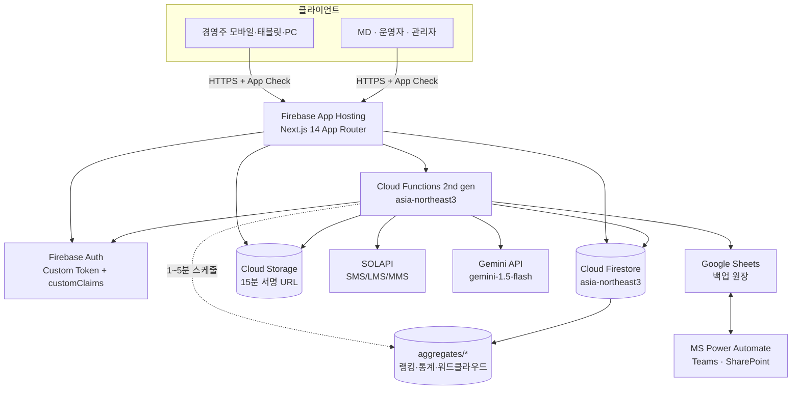

# TECH_STACK — 2027 GS25 상품전략공유회 온라인 전시 플랫폼

> 전국 9개 도시 순회 공유회와 **동일한 동선·진열을 3D 웹으로 재현**한 폐쇄형 전시 플랫폼.
> 사전 등록 경영주만 로그인해 섹션별 상품을 듣고·읽고·퀴즈를 풀어 **스탬프 11개**를 모은다.
>
> **마지막 업데이트: 2026-09-25** · 머신용 원본은 [`public/techstack.json`](public/techstack.json)
>
> Firebase 프로젝트: **`gs25-fair`** (2027-gs25-fair · 270897004705 · doridorimammam-org)

---

## 1. 아키텍처

**흐름 요약**

1. 경영주가 `점포코드 + 휴대폰 뒷4자리`를 입력 → Functions 가 HMAC 비교 후 **SMS OTP** 발송
2. OTP 검증 성공 시 `uid = store_{점포코드}` Custom Token 발급, `activeSessionKey` 교체(동시접속 1대)
3. 전시 관람 중 `enter → consumed → submitQuiz` 이벤트가 **서버 시각 기준**으로 판정되어 스탬프 부여
4. 스탬프 11개 + 설문 → 완주 처리(분산 카운터로 전국 순번) → 관리자가 쿠폰 일괄 발송
5. 주요 이벤트는 `syncQueue` → 1분 배치로 구글시트 백업 → Power Automate 가 본부 보고

---

## 2. 카테고리별 스택

### 2.1 프론트엔드

| 이름 | 버전 | 용도 | 위치 | 비고 |
|---|---|---|---|---|
| Next.js | 14.2.35 | App Router, SSR/ISR, Route Handlers | `next.config.js` | 14.2.5의 알려진 취약점 회피를 위해 패치 버전 사용 |
| React | 18.3 | UI | — | R3F v8 호환을 위해 18 고정 |
| TypeScript | 5.5 | 타입 안전성 | `tsconfig.json` | `strict: true` |
| Tailwind CSS | 3.4 | 디자인 토큰·반응형 | `tailwind.config.ts` | 다크모드 **미사용**(가독성) |
| Framer Motion | 11.3 | 스탬프 연출·시트 전환 | `components/exhibit/StampCelebration.tsx` | |
| TanStack Query | 5.51 | 콘텐츠 캐시 | `app/providers.tsx` | `staleTime` 10분 |
| Recharts | 2.12 | 관리자 차트 | `app/(admin)/admin/dashboard` | |
| lucide-react | 0.417 | 아이콘 | — | |

### 2.2 3D 전시

| 이름 | 버전 | 용도 | 위치 | 비고 |
|---|---|---|---|---|
| three.js | 0.166 | 렌더링 엔진 | — | |
| @react-three/fiber | 8.16 | 선언형 씬 | `components/three/ExpoHallScene.tsx` | `frameloop="demand"` |
| @react-three/drei | 9.109 | OrbitControls·Html·Text | `components/three/ShelfScene.tsx` | |
| detect-gpu | 5.0 | GPU tier 판별 | `lib/gpuTier.ts` | tier 0~1 → 2D 폴백 |
| gltf-transform CLI | — | GLB 최적화 | `public/models/README.md` | 섹션당 ≤3MB, 삼각형 ≤10만 |

**성능 규칙** — 모바일 DPR 최대 1.5, 그림자는 데스크톱만, 조감도 좌우 회전 ±30°, 섹션별 지연 로딩(`next/dynamic`).

### 2.2-A 모션 · 연출

> 2026년판 [25fair.vercel.app](https://25fair.vercel.app) 의 연출 문법(카메라 스플라인 투어 · 도시별 accent 리테마 · 시네마틱 질감)을 참조해 2027 랜딩에 이식했다.

| 이름 | 용도 | 위치 | 비고 |
|---|---|---|---|
| CinematicTour | 랜딩 히어로 — `CatmullRomCurve3` 카메라가 9개 도시를 순회 | `components/public/CinematicTour.tsx` | 진행바 = **카메라 경로 스크러버**(영상 아님) |
| 도시별 accent 테마 | 활성 도시에 따라 UI 전체가 800ms 리테마 + 도시별 3D 환경 분기 | `lib/cityTheme.ts` | 도심/벚꽃/산/홀로그램/네온/산업/바다/들판/섬 9종 |
| FilmOverlay | 그레인 · 비네트 · 레터박스 · 스캔라인 | `components/common/FilmOverlay.tsx` | 전부 CSS, `pointer-events:none` |
| Reveal / RevealText | 스크롤 리빌 · 글자 단위 타이틀 리빌 | `components/common/Reveal.tsx` | reduced-motion 이면 즉시 표시 |
| CustomCursor | 데스크톱 전용 관성 커서 링 | `components/common/CustomCursor.tsx` | 기본 커서를 숨기지 않음(접근성) |
| 로비 앰비언트 | 부유 입자 + 바닥 스포트라이트 스윕 | `components/three/ExpoHallScene.tsx` | `quality === 'high'` 에서만 |
| 라우트 트랜지션 | 앱 내 페이지 전환 페이드·업 | `components/common/AppShell.tsx` | `AnimatePresence mode="wait"` |

**모션 안전장치** — 모든 연출은 ① `prefers-reduced-motion` ② `detect-gpu` tier ③ WebGL 지원 여부를 확인하고,
하나라도 걸리면 정적 그라데이션 히어로(`StaticHeroBackdrop`)로 떨어진다. 3D 번들은 `next/dynamic(ssr:false)` 로
분리해 랜딩 First Load JS 에 포함되지 않는다.

### 2.3 백엔드

| 이름 | 버전 | 용도 | 위치 | 비고 |
|---|---|---|---|---|
| Cloud Functions | 2nd gen (firebase-functions 5.0) | OTP·스탬프·SMS·AI·집계·동기화 | `functions/src/index.ts` | asia-northeast3, Node 20 |
| firebase-admin | 12.3 | 서버 SDK | `functions/src/shared/admin.ts` | |
| zod | 3.23 | 입력 검증 | 전 callable | |
| node:crypto | 내장 | AES-256-GCM / HMAC-SHA256 / timing-safe | `functions/src/shared/crypto.ts` | |
| Next Route Handler | 14.2 | **로컬 개발용** callable 대역 | `app/api/fn/[name]/route.ts` | Firebase 미설정 시 자동 폴백 |

### 2.4 인증 · 접근제어

| 이름 | 용도 | 위치 |
|---|---|---|
| Firebase Auth (Email/Password + Custom Token) | 점포 계정 사전 생성 후 Custom Token 로그인 | `functions/src/auth/index.ts` |
| 경영주 SMS OTP | 점포코드 + 뒷4자리 + 6자리 OTP. 3분 유효, 5회 실패 30분 잠금 | 동일 |
| **본부 이메일 OTP (패스워드리스)** | **비밀번호 없음. Apps Script 가 `@gsretail.com` 주소로만 6자리 난수 Gmail 발송** | `apps-script/Code.gs` |
| Staff 시트 원장 | 본부 계정 화이트리스트(email·role·sectionIds·backupFor·active) | Google Sheets `Staff` 탭 |
| App Check (reCAPTCHA Enterprise) | 비정식 클라이언트 차단 | `lib/appCheck.ts` |
| `beforeUserCreated` / `beforeUserSignedIn` | 공개 가입 차단, `@gsretail.com` 도메인 제한 | `functions/src/auth/index.ts` |
| `activeSessionKey` | 동시접속 1대, 세션 12시간 | `lib/hooks/useSession.tsx` |

### 2.5 데이터 · 스토리지

| 이름 | 용도 | 위치 | 비고 |
|---|---|---|---|
| Cloud Firestore | 운영 원장 | `firestore.rules` | 인덱스 15종 정의 |
| Cloud Storage | 미디어 원본 | `storage.rules` | 15분 만료 서명 URL만 |
| 분산 카운터(샤드 10) | 완주 순번 | `functions/src/exhibit/index.ts` | 오픈 직후 핫스팟 방지 |
| 로컬 JSON 저장소 | 개발 모드 Firestore 대역 | `lib/server/store.ts` | `.devdata/` (git 제외) |

### 2.6 AI · 외부 API

| 이름 | 버전 | 용도 | 위치 | 비고 |
|---|---|---|---|---|
| Gemini API | gemini-1.5-flash | 섹션 챗봇 | `functions/src/ai/index.ts` | 자료 밖 질문은 MD 연결, 1일 50회 |
| SOLAPI (넷리파이 경로) | REST v4 | SMS/LMS 10종 발송 · 잔액 조회 | `lib/server/sms.ts` | **실제 운영 경로.** SDK 없이 HMAC-SHA256 직접 인증 |
| SOLAPI (Functions 경로) | SDK 5.3 | 동일 기능 | `functions/src/shared/solapi.ts` | Firebase 배포 시에만 사용 |
| Google Sheets API | 140 | 백업 원장 · 화이트리스트 | `functions/src/shared/sheets.ts` | |
| MS Power Automate | — | 일일 리포트 · 명단 갱신 HTTP | `functions/src/sync/index.ts` | `X-Integration-Key` timing-safe |
| YouTube (nocookie) | — | MD 라이브 임베드 | `app/(app)/live/page.tsx` | 일부공개, 로그인 사용자만 |

### 2.7 보안

| 이름 | 용도 | 위치 |
|---|---|---|
| Firestore Rules | 비로그인 거부, 역할별 최소 권한 | `firestore.rules` |
| 보안 헤더 (CSP/HSTS/XFO/Referrer/Permissions) | 임베드·유출 방지 | `next.config.js` |
| 워터마크 오버레이 | 점포코드+시각 추적, 제거 감지 재삽입 | `components/common/Watermark.tsx` |
| Rate Limit | 점포 10분 3회 / IP 10분 20회 | `functions/src/shared/rateLimit.ts` |
| 감사 로그 | 로그인·내보내기·쿠폰·워터마크 조작 | `functions/src/shared/audit.ts` |
| Secret Manager | 모든 비밀키 | `functions/src/shared/admin.ts` |
| robots.txt / noindex | 검색엔진 차단 | `public/robots.txt` |

### 2.8 운영 가시성 (Observability)

| 이름 | 용도 | 위치 |
|---|---|---|
| 서버 용량 배터리 인디케이터 | 우측 하단 고정 신호등(ok/warn/danger/critical/offline) | `components/common/ServerBattery.tsx` |
| `/api/server-health` | 메모리·디스크·CPU·업타임 | `app/api/server-health/route.ts` |
| 감사·SMS·백업큐 뷰어 | 관리자 로그 확인 | `app/(admin)/admin/audit/page.tsx` |

### 2.9 품질 · 배포

| 이름 | 용도 | 위치 |
|---|---|---|
| @firebase/rules-unit-testing | Rules 25케이스 | `scripts/testRules.ts` |
| k6 | 동시 3,000 부하 + 권장값 산출 | `scripts/loadtest/k6.js` |
| Firebase App Hosting | Next.js 배포 | `firebase.json` |
| Emulator Suite | 로컬 구동 | `firebase.json` |

---

## 3. 왜 이걸 골랐나

- **Next.js 14 App Router** — 공개 셸(랜딩·레이아웃·빈 진열대)은 CDN 캐시로 넘겨 오픈 순간 트래픽을 흡수하고, **상품 데이터는 정적 빌드에 넣지 않고** 로그인 후에만 가져와 경쟁사 유출 경로를 막는다.
- **React Three Fiber** — 조감도·진열대를 선언형으로 작성해 `sections.hallPosition` 데이터만 바꾸면 코드 수정 없이 배치를 바꿀 수 있다. 저사양 기기는 `detect-gpu` 로 판별해 같은 클릭 영역의 2D SVG 평면도로 자동 전환한다.
- **Cloud Functions 단일 판정** — 스탬프·퀴즈 채점을 클라이언트에서 하면 개발자도구로 완주가 가능하다. 그래서 `enter → consumed → quiz` 를 전부 서버 시각으로 기록하고 `quizAnswers` 컬렉션은 Rules 에서 read/write 를 모두 `false` 로 막았다.
- **aggregates 단일 문서** — 동시접속 3,000명이 랭킹을 각자 계산하면 Firestore 읽기가 폭증한다. 스케줄 함수가 1~5분마다 요약 문서 1건으로 만들고 모든 사용자는 그 1건만 읽는다.
- **SMS OTP 추가** — 점포코드는 비교적 알려져 있고 뒷4자리는 경우의 수가 1만 개뿐이라 단독으로는 추측 접속을 막지 못한다. 등록된 번호로 받은 인증번호를 한 번 더 확인해 "그 점주 본인"만 들어오게 한다.
- **구글시트 백업** — Firestore 장애·실수 삭제에 대비한 이중화이자, Power Automate 로 본부 보고 체계에 그대로 연결되는 접점이다.

---

## 4. 외부 의존 서비스 — 헬스 · 요금 영향

| 서비스 | 장애 시 영향 | 요금 영향 |
|---|---|---|
| **SOLAPI** | 로그인 불가(OTP 미수신) → 최우선 장애. 팝업 공지 + 재시도 안내 | OTP 약 2만 건 + 알림·예약·쿠폰. 건당 과금 |
| **Firebase Functions** | 스탬프·예약 전면 중단 | 호출 수 + GB-초. 행사 기간 `minInstances` 비용 상시 발생 |
| **Firestore** | 전시 조회 불가 | 읽기 기준 하루 1만 명 × 약 125 reads ≈ 125만 reads/일 |
| **Gemini API** | 챗봇만 중단(MD 질의로 폴백) | 토큰 과금. 1인 1일 50회 제한으로 상한 통제 |
| **Google Sheets** | 백업 지연(큐에 적체, 데이터 유실 없음) | 무료 쿼터 내 |
| **YouTube** | 라이브만 중단 | 무료 |
| **App Hosting** | 전면 중단 | 트래픽 + 빌드 |

> 예산 알림은 Firebase 콘솔에서 프로젝트별로 설정한다. SOLAPI 는 일일 발송 한도를 걸어 비용 폭주를 막는다.

---

## 5. 알려진 한계

1. **화면 촬영 유출은 기술만으로 못 막는다.** 워터마크(추적) + 보안서약(억제) + 핵심 수치 비노출(콘텐츠 설계)을 함께 쓴다.
2. **워드클라우드 형태소 분석이 간이 방식**이다. 조사·어미를 규칙으로 잘라내므로 고유명사 분리가 완벽하지 않다. 정확도를 올리려면 Functions 쪽에 mecab 계열을 붙여야 한다.
3. **서버리스 인스턴스 간 공유는 Netlify Blobs 로 임시 해결했다.** 인증·발송 경로의 키(인증번호 세션·세션 토큰·메일 대기열·본부 원장·rate limit)만 대상이며, **마지막에 쓴 쪽이 이긴다.** 스탬프·진행률은 여전히 인스턴스 로컬이다. 근본 해결은 Firestore 이전이다.
5. **로컬 개발 백엔드(`lib/server/**`)는 Cloud Functions 의 대역**이다. 판정 로직은 동일하게 재현했지만 운영 배포 대상이 아니며, 트랜잭션·분산 카운터는 단일 프로세스 가정으로 단순화되어 있다.
4. **미디어 파일(영상·오디오)은 아직 비어 있다.** `MediaPlayer` 가 동일한 90% 규칙을 따르는 데모 플레이어로 대체 동작하며, 관리자 업로드 후 서명 URL 을 넣으면 그대로 전환된다.
6. **3D 모델은 기본 도형**이다. GLB 교체를 전제로 블록 단위로 분리해 두었다(`ZoneBlock`, `Fixture`, `ProductBox`).
7. **본부 로그인은 패스워드리스**다. 회사 메일함을 장악당하면 계정도 함께 뚫린다.
   PRD 2장의 "이메일+비밀번호+2차 인증" 대비 한 단계 약한 구조이며, 운영 요청에 따른 선택이다.
   Staff 원장 화이트리스트·rate limit·5회 실패 잠금·App Check·감사 로그로 보완한다.
8. **onlineNow(현재 접속자)** 는 집계 함수에서 0으로 내려간다. 정확한 값이 필요하면 Realtime Database presence 를 붙여야 한다.
9. **문자 발송은 기본이 `log` 모드**다. `SMS_MODE=live` 로 바꾸기 전까지 실제 발송은 일어나지 않고 `smsLogs` 에만 기록된다.
   실수로 전국 경영주에게 대량 발송하는 사고를 막기 위한 기본값이며, 운영 전환 시 `SMS_ALLOWLIST` 를 비우고 `SMS_MODE=live` 로 설정해야 한다.
   발신번호는 솔라피 콘솔에 사전 등록·인증된 번호만 쓸 수 있다.
10. **Next.js 14 계열 유지** — TRD 제약에 따라 14.x 를 쓰되, 취약점 공지된 14.2.5 대신 14.2.35 패치 버전을 사용한다.

---

## 6. 유지 규칙

기술이 **추가·변경·제거되는 모든 커밋**에서 [`public/techstack.json`](public/techstack.json) 과 이 문서를 **같은 커밋에** 함께 업데이트한다. 둘 중 하나만 갱신하는 것은 금지.

업데이트 트리거: 새 의존성 추가/제거 · 호스팅·배포 환경 변경 · DB/스토리지/CDN 변경 · 인증 방식 변경 · AI 모델/외부 API 추가 · 기능의 legacy 이동.
